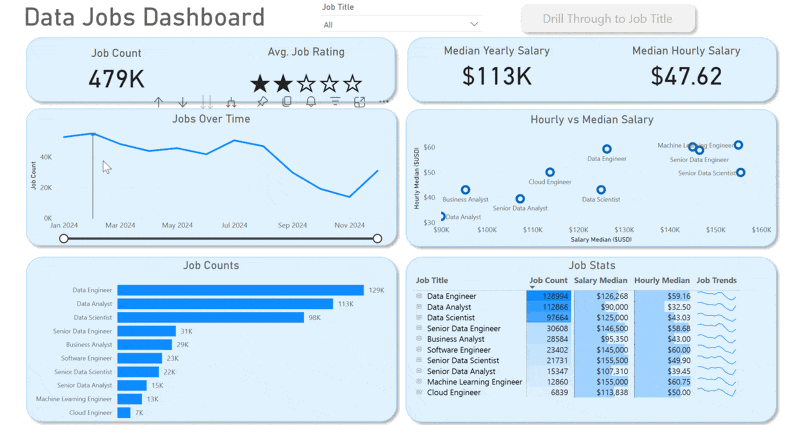
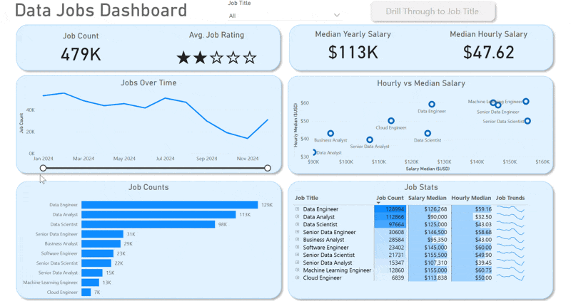
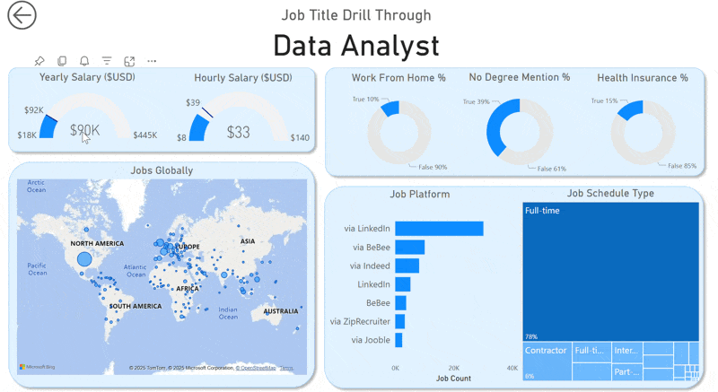

# DATA JOBS DASHBOARD

## 📌 Project Overview

This Power BI dashboard analyzes the global data job market by exploring job demand, salaries, geographic distribution, work arrangements, and hiring trends across different data-related roles.

PROJECT STRUCTURE:
- [Power BI Dashboard File (.pbix)](data_jobs_salaries.pbix)  
- [Readme File]() 
- [Datasets Directory](../../data/)  
- [Images Directory](images/)  

The dashboard enables users to:

- Compare salaries across job titles
- Analyze job demand and trends over time
- Explore geographic distribution of jobs
- Investigate job benefits and requirements
- Drill through into specific job titles for deeper analysis

## Dashboard Global Overview

*This report is split into two distinct pages to provide both a high-level summary and a detailed analysis.*

  

🛠 Tools & Technologies

- Power BI Desktop
- Power Query
- DAX
- Data Modeling
- Interactive Visualizations
- Drill Through Navigation
- Slicers and Filters
- Bing Maps Integration

📈 Skills Demonstrated

- Data Cleaning and Transformation
- Data Modeling
- DAX Calculations
- Dashboard Design
- Data Visualization
- Interactive Reporting
- Business Intelligence
- Storytelling with Data

## High-Level Market View, Page 1

This is your mission control for the data job market. It showcases key KPIs like total job count, median salaries, and top job titles to give you a quick understanding of what's happening in the job market at a glance.

  

#### 1. KPI Cards
🔹 Job Count (479K jobs)

Displays the total number of job postings in the dataset.
The dataset contains nearly half a million job listings.
Indicates a large and diverse data job market.

🔹 Salary Star Rating (3/5 stars)

Represents an aggregated salary rating based on overall compensation.
Data-related careers generally offer competitive salaries. There is still variation in pay depending on specialization.

🔹 Median Yearly Salary ($113K)

Shows the median annual salary across all jobs.
The median salary exceeds $100K, highlighting the strong earning potential in data careers. Useful benchmark for job seekers.

🔹 Median Hourly Salary ($47.62)

Displays the median hourly wage.
Useful for comparing contract and freelance positions.
Indicates high market value for data professionals.

#### 2. Job Trend Line Chart

Displays monthly variations in the number of job postings throughout 2024.
Job postings peaked around mid-year. A noticeable decline occurs toward the end of the year. The downward trend line suggests decreasing hiring activity during 2024. Seasonal hiring patterns may influence recruitment.
This visual may helps job seekers identify the best periods to apply.
Enables recruiters to understand hiring cycles.

#### 3. Hourly vs Yearly Salary Scatter Plot

Compares median annual salaries with median hourly wages for different job titles. Machine Learning Engineer and Senior Data Engineer occupy the highest salary range. Data Analyst roles show the lowest compensation.
Higher seniority generally corresponds to higher salaries.
Strong positive relationship exists between hourly and annual salaries.
This visual may helps professionals choose career paths and
Assists organizations in benchmarking compensation.

#### 4. Job Count by Role

Ranks job titles according to the number of postings.
Data Engineer is the most demanded role (~129K jobs).
Data Analyst follows closely (~113K jobs).
Specialized roles such as Cloud Engineer have lower demand.
Engineering roles dominate the market.
This help in identifying high-demand skills and
Helps learners prioritize career development.

#### 5. Job Statistics Table

Provides detailed statistics for each job title:Job count, Median yearly salary Median hourly salary and Trend sparkline
Machine Learning Engineer offers one of the highest salaries.
Data Engineer combines high demand with strong compensation.
Trend lines reveal whether demand is increasing or decreasing.
This Enables side-by-side comparison of occupations and
Supports career and hiring decisions.

#### 6. Job Title Slicer and Drill Through Button

Slicer allows users to filter the dashboard by job title.
Users can focus analysis on specific roles.
Enables interactive exploration of salary and demand.

Drill Through navigates users to a dedicated page for detailed analysis of a selected job title. Provides deeper insights without overcrowding the main dashboard. Enhances user experience and interactivity.

---

## Job Title Drill Through, Page 2

This is the deep-dive page. From the main dashboard, you can drill through to this view to get specific details for a single job title, including salary ranges, work-from-home stats, top hiring platforms, and a global map of job locations.

  

#### 1. Gauges

Yearly Salary Gauge, displays the median annual salary relative to the minimum, maximum and average salaries observed.

Hourly Salary Gauge, displays the median hourly salary relative to the minimum, maximum and average salaries observed.

#### 2. Donuts

Work From Home Percentage, Shows the proportion of remote jobs. Its helps candidates understand work flexibility.

No Degree Mention Percentage, indicates whether job postings explicitly require a degree. This can encourages self-taught professionals and career changers.

Health Insurance Percentage, shows the proportion of job postings offering health insurance. Benefits information may be omitted in many postings.

#### 3. Global Job Distribution Map

Displays the geographic distribution of job opportunities worldwide. This helps professionals identify regions with strong demand.

#### 4. Job Platform Analysis

Horizontal Bar Chart shows which job platforms contain the most postings.
Job seekers should prioritize major platforms.
This Optimizes job search strategies and
Helps recruiters understand platform effectiveness.

#### 5. Job Type Treemap

Displays the distribution of employment types.
This helps candidates align expectations with market demand.

## 🔍 Key Findings from the Dashboard
- Data Engineer is the most in-demand data profession.
- Machine Learning Engineer offers the highest salaries.
- The majority of jobs are full-time.
- LinkedIn is the leading recruitment platform.
- Most data jobs are concentrated in North America and Europe.
- Remote opportunities exist but remain limited for some roles.
- Degree requirements are becoming less strict in many postings.

--- 

## **Project draft**

